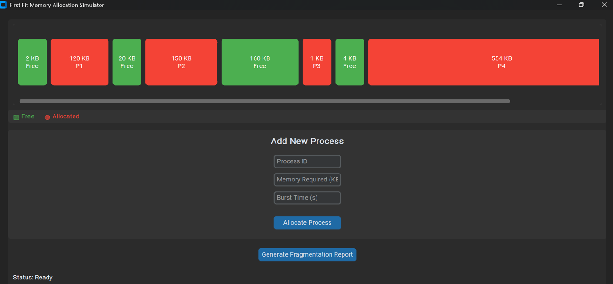

Implementing a Dynamic Memory Allocation Simulation

Introduction:
This project aims to demonstrate how operating systems manage memory dynamically using different memory allocation strategies. We implemented a simulator in Python using CustomTkinter, with a focus on the First Fit algorithm. The application supports memory allocation, deallocation (based on process burst time), and fragmentation reporting.

Overview of Memory Allocation Algorithms:

Algorithm	Description
	
First Fit	Allocates the first memory block that is large enough	
Best Fit	Allocates the smallest block that fits the process	
Worst Fit	Allocates the largest available block	
Next Fit	Like First Fit, but continues search from last allocated block	

